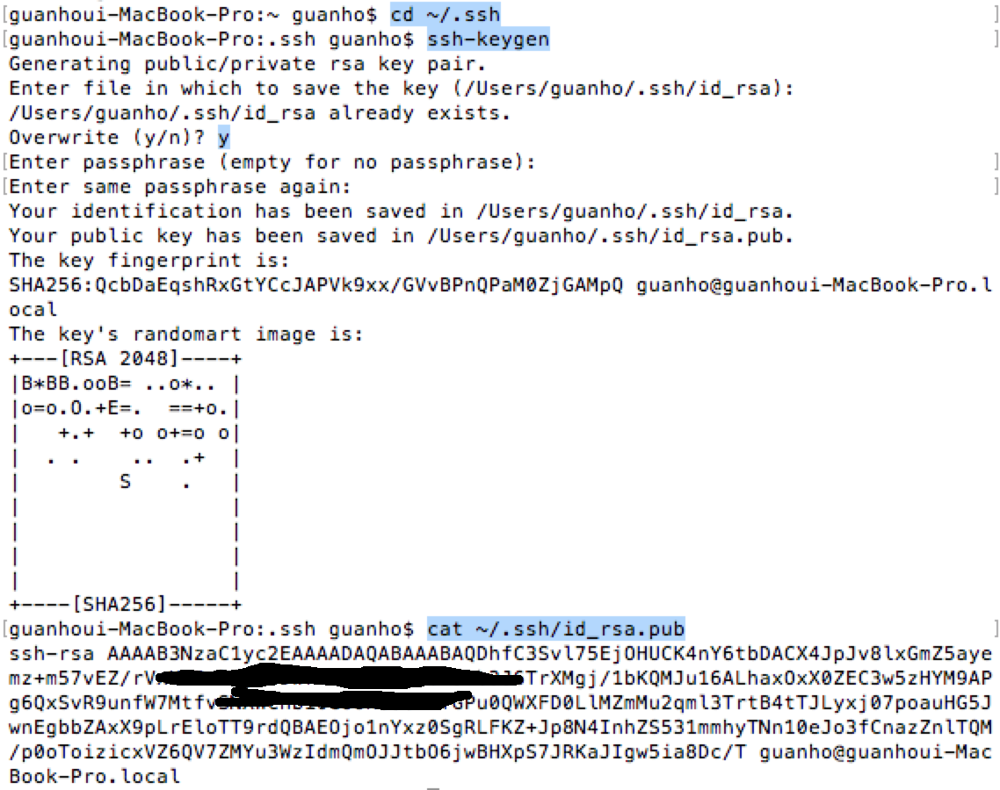

## private 프로젝트 ssh 관련
- private 저장소를 사용하기 때문에 ssh가 필요한데 하나의 ssh키는 하나의 프로젝트만가능
- git push 시 ssh이름을 다른 이름으로 하게 되면 git이 catch를 못하게 되는 상황 발생

### 해결책

> 각자 엑티, 이종석 앱을 작업할때 ssh key값을 git홈페이지에서 바꿔줘야함

#### ssh키 만들기

window환경에서는 git bash창을 연다.
unix환경에서는 터미널을 연다
이후 공통

~~~~
$ cd ~/.ssh
$ ssh-keygen
~~~~

(여기서 이미 ssh키가 있을 경우 overwrite(y/n) 이 나온다. y를 선택)

그러면 

~~~~
Enter file in which to save the key (/.../.ssh/id_rsa):
~~~~

여기서 key가 저장되는 파일명을 선택하라는데 Default로 Enter을 누른다.

~~~~
Enter passphrase (empty for no passphrase):
~~~~

원하는 비밀번호를 누른다.

~~~~
Enter same passphrase again:
~~~~

원하는 비밀번호를 다시 누른다.

이제 키가 만들어졌고

~~~~
$ cat ~/.ssh/id_rsa.pub
~~~~

명령어를 입력하면

~~~~
ssh-rsa AAAAB3NzaC1yc2EAAAABIwAAAQEAklOUpkDHrfHY17SbrmTIpNLTGK9Tjom/BWDSU
GPl+nafzlHDTYW7hdI4yZ5ew18JH4JW9jbhUFrviQzM7xlELEVf4h9lFX5QVkbPppSwg0cda3
Pbv7kOdJ/MTyBlWXFCR+HAo3FXRitBqxiX1nKhXpHAZsMciLq8V6RjsNAQwdsdMFvSlVK/7XA
t3FaoJoAsncM1Q9x5+3V0Ww68/eIFmb1zuUFljQJKprrX88XypNDvjYNby6vw/Pb0rwert/En
mZ+AW4OZPnTPI89ZPmVMLuayrD2cE86Z/il8b+gw3r3+1nKatmIkjn2so1d01QraTlMqVSsbx
NrRFi9wrf+M7Q== schacon@agadorlaptop.local
~~~~

이런식으로 뜬다.
ssh-rsa부터 끝까지 copy를 한다.

  
#### key만들기 이미지 설명

    

### github홈페이지에서 ssh키 등록하기

그리고 github 페이지에 가서 진행하고 있던 프로젝트를 누른다.
상단 탭에서 Settings를 누른다.
왼쪽 탭에서 Deploy keys를 누른다.
그리고 자기가 사용하였던 ssh키를 Delete를 한다.
(여기서 자기가 사용했었던 key는 다시 재사용할수 없기 때문에 너무 많은 키를 만들지 않을려고 삭제를 해준다.)

진행할 프로젝트를 선택한다.
상단 탭에서 Settings를 누른다.
왼쪽 탭에서 Deploy keys를 누른다.
Add deploy key를 누른다.
Title에 자신이 쓸 이름을 적는다.
그리고 Key에 그전에 Copy했던 ssh키를 paste를 한다.
그리고 Allow write access 체크를 하고 Add key를 한다.

    

#### github ssh 키 위치와 Delete, Add deploy key

#### github Add deploy key 화면
